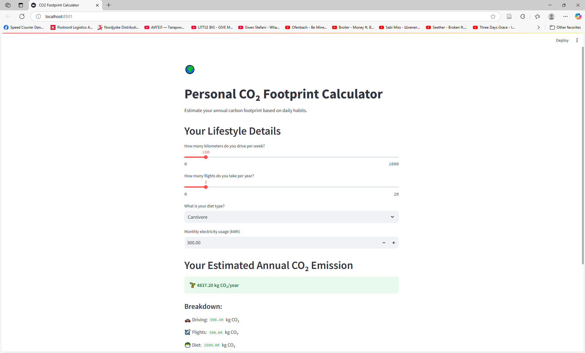

# 🌍 Personal CO₂ Footprint Calculator

This project is a simple and interactive Streamlit app that estimates your **annual carbon footprint** based on your lifestyle habits — such as driving, flying, diet, and electricity usage.


## 🧠 Features

- 🚗 Calculates CO₂ emissions from car usage
- ✈️ Estimates impact from air travel
- 🥗 Includes diet-based emissions (carnivore, vegetarian, vegan)
- ⚡ Tracks electricity-related emissions
- 📊 Shows total yearly CO₂ and category breakdown
- 💡 Offers tips to reduce your carbon footprint




## 🛠️ Technologies Used

- Python 3
- [Streamlit](https://streamlit.io/)
- Simple CO₂ factor-based calculations

## 📦 Installation

Clone this repository and install the dependencies:

```bash
git clone https://github.com/davidsilaghi18/co2-footprint-calculator.git
cd co2-footprint-calculator
pip install -r requirements.txt
